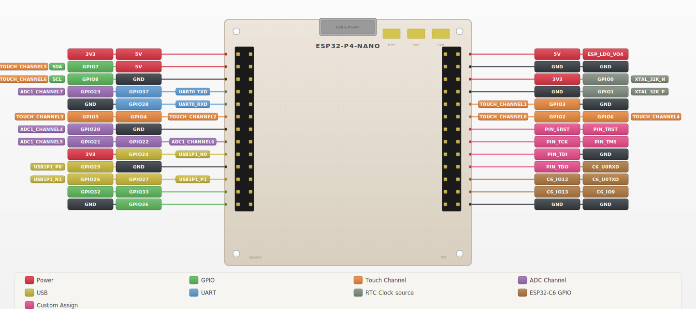

# jtag-idf-component

A general-purpose JTAG programmer component for ESP-IDF. Scan chains, program FPGAs, flash microcontrollers, play SVF files -- all from an ESP32 with a browser UI.

> Built for **ESP-IDF v6.0**. Tested on **ESP32-S3** (WiFi) and **ESP32-P4** (Ethernet + DMA-accelerated JTAG).

---


---

## At a Glance

| | |
|---|---|
| **Chain scan** | Auto-detect every device on the JTAG chain -- XMOS, Lattice, Xilinx, Espressif, ARM DAP and more |
| **SVF player** | Play Serial Vector Format files to program any JTAG-capable device *(coming soon)* |
| **XMOS support** | Full xCORE programming: load `.xe` to RAM, program SPI flash, debug register access |
| **iCE40 support** | Program Lattice iCE40 FPGAs via SPI (CRAM and flash) *(coming soon)* |
| **Boundary scan** | Capture all I/O pin states, auto-detect BSR length, live refresh from the browser |
| **Two backends** | GPIO bit-bang on any ESP32 (1-5 MHz) **or** PARLIO DMA on ESP32-P4 (up to 40 MHz) |
| **Web UI** | Visual chain diagram, firmware inspector, one-click flash -- no tools to install |

## Supported Targets

### XMOS (fully implemented)

| Family | Chips | IDCODE | Tiles |
|---|---|---|---|
| **xCORE.ai** (XS3) | XU316 | `0x00006633` | 2 |
| **xCORE-200** (XS2) | XU208, XU216 | `0x00005633` | 1--2 |
| **XS1** (legacy) | XS1-G1, G4, SU | `0x00002633` `0x00104731` `0x00003633` | 1--4 |

- Load firmware to RAM via JTAG boot (`.xe` or raw ELF)
- Program SPI flash (direct or via JTAG-loaded stub)
- Debug register access (PSWITCH/SSWITCH)
- XE file parser verified against real multi-tile satellite firmware

### FPGAs & Other Devices (chain scan + SVF)

The chain scanner recognises **Lattice ECP5/iCE40**, **Xilinx 7-Series**, **Espressif SoCs**, and **ARM CoreSight DAPs** by IDCODE. Any JTAG device can be driven via SVF file playback.

| Device | Programming Method | Status |
|---|---|---|
| Lattice iCE40UP5K | SPI slave (CRAM/flash) | *planned* |
| Lattice ECP5 | JTAG (SVF) | *via SVF player* |
| Xilinx 7-Series | JTAG (SVF) | *via SVF player* |
| Any JTAG device | SVF file playback | *planned* |

> **1.8 V I/O** -- XMOS JTAG signals are 1.8 V. Most FPGAs support configurable I/O banks. Use a level shifter between the ESP32 (3.3 V) and 1.8 V targets. On the ESP32-P4-NANO the `LDO_VO4` header pin supplies 1.8 V for the shifter's low-voltage rail.

---

## Use Cases

**Production & Manufacturing**
- Flash firmware on the assembly line without a PC -- just an ESP32, a browser, and a JTAG cable
- Boundary scan for board-level continuity testing before functional test
- Chain scan to verify correct device population and orientation

**CI / CD & Automated Testing**
- Drive the ESP32 flasher from a test script over HTTP (`curl -X POST /api/upload ...`)
- Load nightly builds to RAM, run tests, repeat -- no flash wear, instant boot
- Gate firmware releases on automated JTAG connectivity checks

**Field Updates & OTA**
- ESP32 pulls new firmware over WiFi/Ethernet, then JTAG-boots the target -- true over-the-air updates for devices with no native network stack
- Dual-bank strategy: load to RAM for validation, then commit to SPI flash only if self-test passes

**Development & Debugging**
- Rapid edit-compile-load cycle without an XTAG adapter or expensive JTAG probe
- Inspect I/O pin states in real time via boundary scan from any browser
- Identify unknown or mislabelled parts via IDCODE + chain scan

**Multi-Device Systems**
- Single ESP32 manages the JTAG chain of an entire board (XMOS + FPGA + MCU)
- Chain visualization shows every device -- useful for bring-up of complex PCBs

---

## Getting Started

### 1. Add the component

```sh
cd your-project/components
git clone https://github.com/DatanoiseTV/jtag-idf-component.git jtag_prog
```

### 2. Configure

```sh
idf.py menuconfig   # -> JTAG Programmer
```

| Option | Default | |
|---|---|---|
| `XMOS_JTAG_BACKEND` | GPIO | GPIO bit-bang **or** PARLIO DMA (ESP32-P4) |
| `XMOS_JTAG_TCK_FREQ_KHZ` | 1 000 / 10 000 | Clock frequency |
| `XMOS_JTAG_PARLIO_DMA_BUF_SIZE` | 4 096 | DMA buffer (PARLIO only) |

### 3. Use the API

```c
#include "xmos_jtag.h"

/* Initialise */
xmos_jtag_pins_t pins = {
    .tck = GPIO_NUM_47, .tms = GPIO_NUM_48,
    .tdi = GPIO_NUM_46, .tdo = GPIO_NUM_45,
    .trst_n = GPIO_NUM_53, .srst_n = GPIO_NUM_54,
};
xmos_jtag_handle_t jtag;
ESP_ERROR_CHECK(xmos_jtag_init(&pins, &jtag));

/* Scan the chain -- works with any JTAG device */
jtag_chain_t chain;
xmos_jtag_scan_chain(jtag, &chain);
for (int i = 0; i < chain.num_devices; i++)
    printf("[%d] %s  0x%08lx\n", i, chain.devices[i].name,
           (unsigned long)chain.devices[i].idcode);

/* Identify XMOS device specifically */
xmos_chip_info_t info;
xmos_jtag_identify(jtag, &info);

/* Load XMOS firmware */
extern const uint8_t fw[] asm("_binary_firmware_xe_start");
extern const uint8_t fw_end[] asm("_binary_firmware_xe_end");
xmos_jtag_load_xe(jtag, fw, fw_end - fw, true);
```

### Program an iCE40 FPGA

```c
#include "jtag_ice40.h"

ice40_pins_t ice_pins = {
    .spi_cs   = GPIO_NUM_20,
    .spi_clk  = GPIO_NUM_23,
    .spi_mosi = GPIO_NUM_5,
    .spi_miso = GPIO_NUM_4,
    .creset   = GPIO_NUM_21,
    .cdone    = GPIO_NUM_22,
};

/* Load bitstream to CRAM (volatile -- lost on power cycle, fast for dev) */
extern const uint8_t bitstream[] asm("_binary_top_bin_start");
extern const uint8_t bitstream_end[] asm("_binary_top_bin_end");

ESP_ERROR_CHECK(ice40_program_cram(
    &ice_pins, bitstream, bitstream_end - bitstream, 3000));

/* Or write to SPI flash (persistent -- FPGA boots automatically) */
ESP_ERROR_CHECK(ice40_program_flash(
    &ice_pins, bitstream, bitstream_end - bitstream, 0));

/* Reset the FPGA */
ESP_ERROR_CHECK(ice40_reset(&ice_pins, 3000));
```

### Play an SVF file

```c
#include "jtag_svf.h"

/* SVF data loaded from SPIFFS, HTTP download, embedded binary, etc. */
extern const char svf_data[] asm("_binary_program_svf_start");
extern const char svf_data_end[] asm("_binary_program_svf_end");

/* Optional: track progress */
void on_progress(size_t bytes, size_t total, size_t cmds, void *ctx) {
    printf("SVF: %zu/%zu bytes, %zu commands\n", bytes, total, cmds);
}

svf_config_t cfg = {
    .progress_cb = on_progress,
    .stop_on_mismatch = false,  /* true to abort on TDO verification failure */
};
svf_result_t result;

ESP_ERROR_CHECK(svf_play(jtag, svf_data, svf_data_end - svf_data, &cfg, &result));

printf("Done: %zu commands, %zu TDO mismatches\n",
       result.commands_executed, result.tdo_mismatches);
```

---

## Web Flasher Example

A ready-to-flash example with a browser UI lives in `example/`.

```sh
cd example

# ESP32-S3 -- WiFi AP
idf.py set-target esp32s3 && idf.py build flash monitor
# Connect to "XMOS-Flasher" (pw: xmosjtag), open http://192.168.4.1

# ESP32-P4-NANO -- Ethernet (IP101GRI)
idf.py set-target esp32p4 && idf.py build flash monitor
# Plug in Ethernet, check serial log for DHCP address
```

**What the UI does:**

| Section | |
|---|---|
| **Device** | One-click identify -- IDCODE, family, tiles, revision |
| **JTAG Chain** | Visual diagram: `TDI -> [XU316] -> [ECP5] -> TDO` |
| **Boundary Scan** | Live pin-state capture with hex + bit view, auto-refresh |
| **Firmware** | Drag-and-drop `.xe` / `.bin` / `.svf`, shows file details |
| **Program** | Select target (XMOS / iCE40 / SVF) and method (RAM / Flash / CRAM), one-click go |

---

## Wiring

```
ESP32              Target JTAG
──────             ───────────
GPIO  (TCK)   ──>  TCK
GPIO  (TMS)   ──>  TMS
GPIO  (TDI)   ──>  TDI         Use a level shifter if
GPIO  (TDO)   <──  TDO         target I/O != 3.3 V
GPIO  (TRST)  ──>  TRST_N      (active low, optional)
GPIO  (SRST)  ──>  RST_N       (open-drain, optional)
GND           ──>  GND
```

### Waveshare ESP32-P4-NANO



JTAG and SPI use separate headers so both can be wired simultaneously.

**JTAG -- Right Header** (rows 7-10)

| Signal | GPIO | Position |
|---|---|---|
| TCK | 47 | Row 8 inner |
| TMS | 48 | Row 8 outer |
| TDI | 46 | Row 9 inner |
| TDO | 45 | Row 10 inner |
| TRST | 53 | Row 7 outer |
| SRST | 54 | Row 7 inner |

**SPI / iCE40 -- Left Header** (rows 4, 6-8)

| Signal | GPIO | Position |
|---|---|---|
| SPI_CLK | 23 | Row 4 outer |
| SPI_MOSI | 5 | Row 6 outer |
| SPI_MISO | 4 | Row 6 inner |
| SPI_CS | 20 | Row 7 outer |
| ICE40_CRESET | 21 | Row 8 outer |
| ICE40_CDONE | 22 | Row 8 inner |

Ethernet (IP101GRI over RMII) handles networking on internal GPIOs. The **LDO_VO4** pin (Right Row 1, outer) provides **1.8 V** for a JTAG level shifter if the target uses 1.8 V I/O.

---

## Architecture

```
components/xmos_jtag/
 include/
   xmos_jtag.h            XMOS API (chain scan, identify, bscan, load, flash)
   xmos_xe.h              XE / ELF parser
   jtag_svf.h             SVF player API
   jtag_ice40.h           iCE40 SPI programmer API
 src/
   jtag_transport.h        Backend vtable (shift_ir, shift_dr, reset, idle)
   jtag_gpio.c             GPIO bit-bang   -- any ESP32
   jtag_parlio.c           PARLIO + DMA    -- ESP32-P4
   svf_player.c            SVF file parser and executor
   ice40.c                 iCE40 CRAM + SPI flash programmer
   xmos_regs.h             XMOS TAP, MUX, PSWITCH, debug register map
   xmos_jtag.c             XMOS protocol layer + known-device database
   xmos_xe.c               XE container + ELF32 segment parser
```

### JTAG Backends

**GPIO bit-bang** -- portable `gpio_set_level` / `gpio_get_level`. Runs on every ESP32 variant at 1--5 MHz TCK.

**PARLIO DMA** (ESP32-P4) -- the Parallel IO peripheral clocks out TMS + TDI on two data lines while a second DMA channel captures TDO, all in hardware:

- TX `data_width = 2`, one byte = 4 JTAG cycles
- RX `data_width = 1`, clocked from TCK via GPIO matrix loopback
- Up to **40 MHz TCK** from the 160 MHz PLL

### Protocol Stack

The component is layered so device-specific logic sits on top of a generic JTAG transport:

```
 ┌─────────────┐  ┌──────────────┐  ┌─────────────┐
 │  XMOS xCORE │  │  SVF Player  │  │ iCE40 (SPI) │   Device-specific
 │  (MUX, DBG) │  │  (generic)   │  │             │
 └──────┬──────┘  └──────┬───────┘  └──────┬──────┘
        │                │                  │
 ┌──────┴────────────────┴──────────────────┘
 │          Generic JTAG Transport
 │    (shift_ir, shift_dr, reset, idle)
 ├─────────────────┬─────────────────┐
 │  GPIO bit-bang  │   PARLIO DMA    │               Hardware backends
 └─────────────────┴─────────────────┘
```

### XMOS Protocol

1. **Top-level TAP** -- 4-bit IR (IEEE 1149.1). IDCODE = `0x1`, SET_TEST_MODE = `0x8`.
2. **MUX** (IR `0x4`) -- opens the internal chain: OTP + xCORE + CHIP + BSCAN = 20-bit IR.
3. **Register access** -- xCORE TAP IR = `(reg << 2) | rw`. DR = 32/33 bits.
4. **Debug mode** -- enter via `PSWITCH_DBG_INT`, memory R/W through scratch-register mailbox.
5. **JTAG boot** -- SET_TEST_MODE bit 29, upload code, set PC, resume.

### XE File Format

Verified against `tool_axe` reference parser **and** real multi-tile satellite firmware:

- 12-byte sector header with uint64 length + padding descriptor
- Sector types: ELF `0x02`, BINARY `0x01`, GOTO `0x05`, CALL `0x06`, XN `0x08`
- Per-tile ELF32 with PT_LOAD segments; raw ELF accepted too

---

## Tests


**56 host-side tests** -- run on your dev machine, no hardware needed:

```sh
cd test && make test
```

Covers XE parsing (synthetic + real `.xe` files), ELF edge cases, JTAG chain-IR encoding (all 256 registers verified to fit 20 bits), MUX constants, PARLIO bit packing, TAP state-machine simulation, and structural validation of real firmware images.

---

## Known Limitations

- **XMOS debug commands** and PSWITCH register addresses were reverse-engineered from `sc_jtag` and forum posts -- may need tuning on untested silicon.
- **SVF player** and **iCE40 SPI programmer** are planned but not yet implemented.
- **XS3** IDCODE `0x00006633` confirmed from datasheet but end-to-end protocol not tested on hardware yet.

---

## License

MIT
